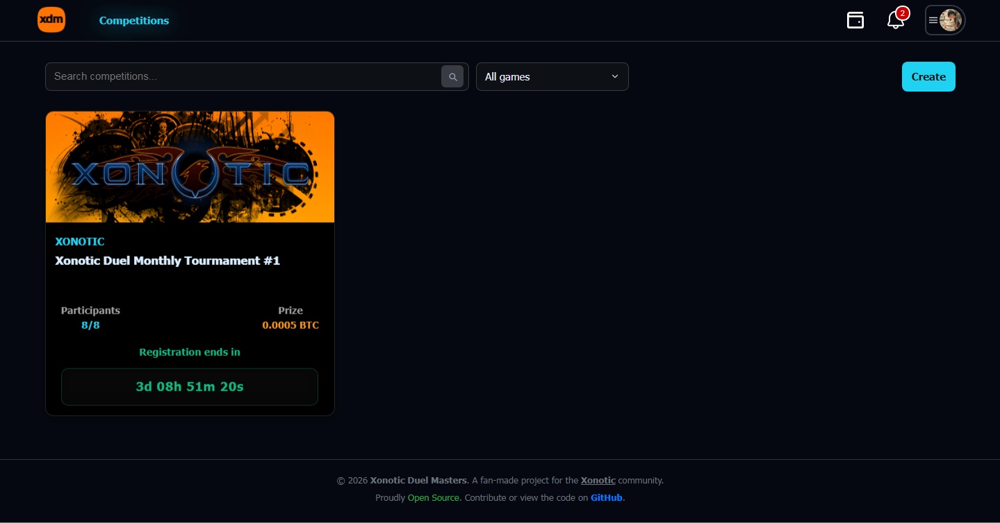

# community-tournaments

Community-run single-elimination tournament platform built by players for players.  
No corporate bullshit. No paywalls.  
Pure PHP backend • MySQL • aggressive vanilla-JS SPA • Workerman websocket for live chat and notifications • BSC blockchain integration in developement.

---

---

## What this repo is
A lightweight, community-first tournament platform:
- single-elimination brackets
- participant check-in & match reporting
- per-tournament live chat and notifications via Workerman 
- pure PHP backend, MySQL, minimal dependencies, and a fast vanilla-JS SPA frontend

## Stack
- PHP (backend)
- MySQL (database)
- Vanilla JavaScript SPA (frontend)
- Workerman (WebSocket chat)

## Rewards (BNB / BSC) - [Under Developement]
- Players can withdraw winnings to their own BSC wallet addresses; payouts are recorded on-chain.  
- Each user may have an on-chain wallet address stored (optional). Platform keeps payout transaction logs for auditing.  
- This feature is toggleable — can be enabled for events that have sponsored or donated prizes, or disabled if you prefer not to use on-chain payouts.  

## Contributing
PRs welcome. Keep changes focused and don’t commit secrets.

## License
MIT
