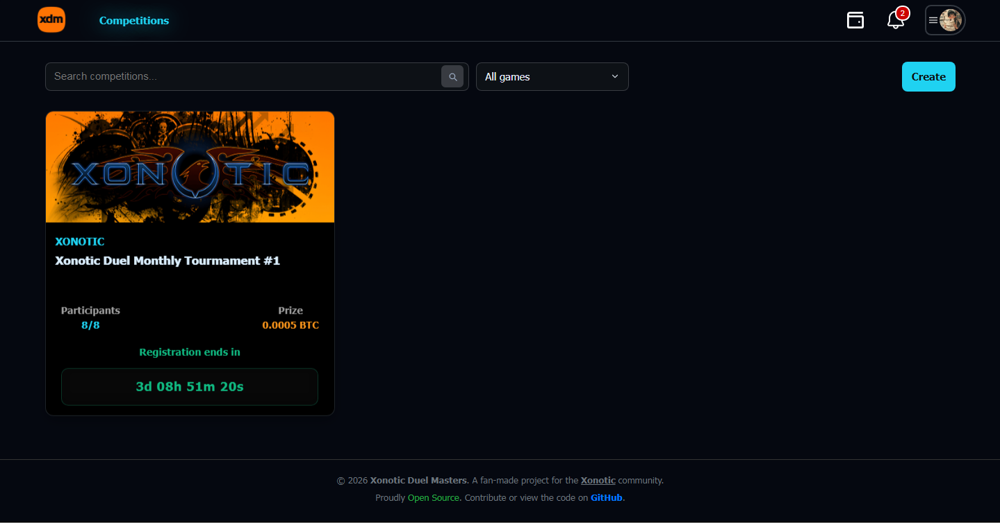

# 🏆 Duel Masters — Community Tournament Platform

This is the source code behind **[duelmasters.gamer.gd](https://duelmasters.gamer.gd)** — a free, community-run tournament platform built by fans, for fans.

We publish our code openly so the community can see exactly how the platform works, report issues, and contribute improvements. No secrets, no black boxes.

---

## 🌐 Want to play? Head to the site

👉 **[duelmasters.gamer.gd](https://duelmasters.gamer.gd)**

This repo is just the code. To join tournaments, create an account, or hang out — go to the site.

---

## 💬 Found a bug? Have an idea?

Open an [issue](https://github.com/amin-aich/community-tournaments-platform/issues) and let us know. This platform is built around the community — your feedback actually matters here.

---

## 🤝 Want to contribute?

You don't have to be a developer to help. You can:

- 🐛 **Report bugs** — something broke? Tell us
- 💡 **Suggest features** — open an issue with your idea
- 🧑‍💻 **Submit a PR** — if you can code, fixes and improvements are welcome

Keep changes focused. Don't try to make it commercial — this is and will stay a free fan project.

---

## ₿ Rewards System *(Coming Soon)*

We're working on a Bitcoin-based rewards system so tournament winners can earn real prizes. No middleman, no platform cut — straight to your wallet.

---

## Tech Stack

Backend: PHP & MySQL (Robust, server-side logic)

Real-time: Workerman WebSockets (Live match updates)

Frontend: Vanilla JavaScript (Fast, framework-less UI)

Philosophy: Minimal dependencies for maximum transparency.

---

## License

MIT — the code is yours to read and learn from.

---

*Fan-made. Community-run. Free forever.*
